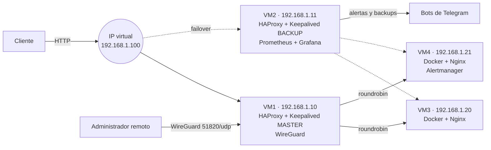

# Infraestructura web de alta disponibilidad con monitorización

Proyecto final del **CFGS Administración de Sistemas Informáticos en Red (ASIR)** · IES María Enríquez · 2025
Autor: **Carlos Aparici Pérez**

Infraestructura de 4 máquinas virtuales Ubuntu Server 22.04 que sirve una web con **balanceo de carga**, **failover automático**, **VPN**, **monitorización con alertas** y **copias de seguridad automáticas**. El objetivo era montar, de principio a fin, una infraestructura como las que se usan en producción.

## Arquitectura



| Máquina | IP | Servicios |
|---|---|---|
| VM1 | 192.168.1.10 | HAProxy, Keepalived (MASTER), servidor WireGuard |
| VM2 | 192.168.1.11 | HAProxy, Keepalived (BACKUP), Prometheus, Grafana |
| VM3 | 192.168.1.20 | Docker + Nginx (servidor web 1) |
| VM4 | 192.168.1.21 | Docker + Nginx (servidor web 2), Alertmanager |

Todas las VMs: Ubuntu 22.04 LTS sobre VirtualBox, con un adaptador NAT y otro de red interna. Node Exporter en las cuatro.

## Qué hace cada pieza y por qué la elegí

| Tecnología | Función en el proyecto | Por qué |
|---|---|---|
| **HAProxy** | Reparte el tráfico HTTP entre VM3 y VM4 (`roundrobin`) con *health checks* | Ligero, muy rápido y con panel de estadísticas propio |
| **Keepalived (VRRP)** | Mantiene la IP virtual `192.168.1.100` en el balanceador activo | Si VM1 cae, VM2 toma la IP sin tocar DNS ni clientes |
| **WireGuard** | Acceso remoto cifrado a la red (red VPN `10.0.0.0/24`) | Más simple y rápido que OpenVPN o IPsec |
| **Docker + Nginx** | Servidores web en contenedores con `--restart always` | Despliegue idéntico y reproducible en las dos VMs |
| **Prometheus + Node Exporter** | Métricas de CPU, RAM, red, HAProxy y Nginx cada 15 s | Estándar de facto en monitorización |
| **Grafana** | Dashboards a partir de Prometheus | Visualización clara y alertas |
| **Bots de Telegram** | Notifican alertas y el resultado de cada backup | Avisos inmediatos en el móvil, sin servidor de correo |

## Estructura del repositorio

```
configs/
  todas/node_exporter.service   servicio systemd (las 4 VMs)
  vm1/haproxy.cfg               idéntico en VM1 y VM2
  vm1/keepalived.conf           nodo MASTER
  vm1/wg0.conf                  servidor WireGuard
  vm2/keepalived.conf           nodo BACKUP
  vm2/prometheus.yml            objetivos de monitorización
docker/                         Dockerfile, nginx.conf e index.html del panel
scripts/backup_grafana.sh       backup semanal con aviso por Telegram
```

> Las credenciales, claves privadas y tokens se han sustituido por variables o marcadores (`CAMBIAR_...`). Nunca se suben secretos a un repositorio.

## Pruebas realizadas

**Failover del balanceador**

```bash
# VM1 (MASTER): detener Keepalived
sudo systemctl stop keepalived
# VM2: ver cómo asume el rol MASTER y la IP virtual
sudo journalctl -u keepalived -f     # "VRRP_Instance(VI_1) Entering MASTER STATE"
ip a show enp0s8                     # aparece 192.168.1.100
```

Al volver a arrancar VM1, recupera la IP virtual por tener mayor prioridad (101 frente a 100). El servicio web sigue respondiendo durante todo el proceso.

**Resto de comprobaciones**

- Balanceo: peticiones sucesivas a la IP virtual alternan entre VM3 y VM4. Panel de HAProxy en `:8080/stats`.
- VPN: el cliente WireGuard accede a los servicios internos como si estuviera en la red local.
- Monitorización: métricas de las 4 VMs, de HAProxy y de Nginx en Grafana; alertas de CPU, RAM y caída de servicios recibidas por Telegram.
- Backups: `cron` ejecuta el script cada domingo a las 2:00 y notifica el resultado por Telegram.

## Decisiones de diseño

| Necesidad o riesgo | Cómo lo resolví |
|---|---|
| Riesgo de que un equipo ajeno anuncie VRRP con más prioridad y se quede con la IP virtual | Bloque `authentication` en Keepalived y vigilancia de anuncios con `tcpdump -i enp0s8 vrrp` |
| Que los servidores web arranquen solos tras un reinicio | Contenedores con `--restart always`, comprobado con `sudo reboot` + `docker ps` |
| Evitar que los backups antiguos llenen el disco | El script elimina las copias previas antes de crear la nueva |
| Saber si un backup ha fallado sin entrar en la máquina | Notificación por Telegram tanto del éxito como del error, y log en `/var/log` |

## Mejoras futuras

- HTTPS con certificados en HAProxy.
- `track_script` en Keepalived para conmutar también si cae el proceso de HAProxy (no solo la máquina).
- Logs centralizados con ELK o Loki.
- Redundancia de Prometheus y Grafana, que ahora solo están en VM2.

## Tecnologías

`Ubuntu Server 22.04` `VirtualBox` `HAProxy` `Keepalived` `VRRP` `WireGuard` `Docker` `Nginx` `Prometheus` `Node Exporter` `Alertmanager` `Grafana` `Bash` `cron` `Telegram Bot API`
